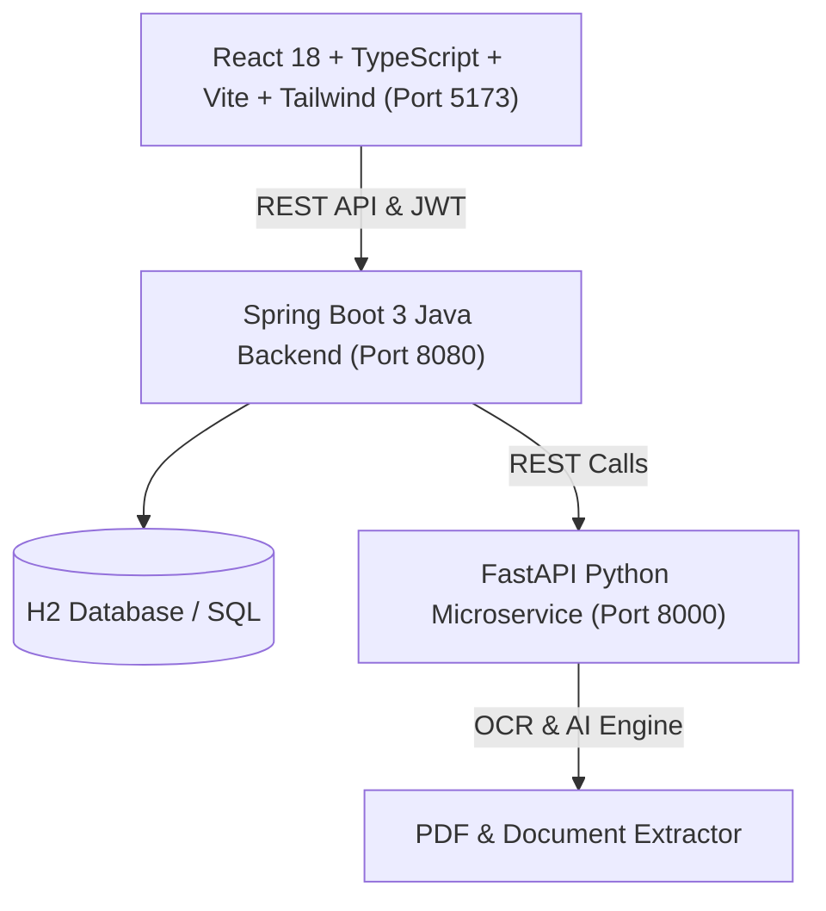

# DocMind - AI Document Assistant & Opportunity Matcher

DocMind is an intelligent full-stack document management and career opportunity application. It uses OCR, automated text extraction, AI microservices, and modern web UI to help users manage personal documents, monitor expirations, match profiles with career opportunities, and interact with an AI document assistant.

---

## 🏗️ System Architecture

DocMind is built with a modular 3-tier architecture:



---

## ⚡ Tech Stack

- **Frontend**: React 18, TypeScript, Vite, Tailwind CSS, Lucide Icons, Recharts, Axios, React Router v6
- **Backend**: Java 17, Spring Boot 3, Spring Security, JWT Authentication, Spring Data JPA, H2 Database
- **AI Microservice**: Python 3.12, FastAPI, Uvicorn, PyPDF2, PDFPlumber, Pydantic, RapidFuzz
- **Database**: H2 In-Memory / PostgreSQL compatible schema

---

## 🚀 Services Overview

### 1. Frontend (`/frontend`)
- Modern, responsive dashboard built with Vite and Tailwind CSS.
- **Pages**: My Documents, Digital Profile, Document Bundles, AI Assistant, Opportunities, Notifications, Security Audit, Settings.

### 2. Java Backend (`/backend`)
- REST APIs for user registration, authentication, document storage, bundle generation, and audit logging.
- Includes Spring Security with JWT filter and role-based endpoints.

### 3. Python AI Microservice (`/ai-service`)
- FastAPI endpoints for OCR/PDF text extraction, intelligent intent detection, job/opportunity matching score calculation, and live job searches.

---

## 🛠️ Local Development & Running

### Prerequisites
- **Java 17+** and Maven installed
- **Python 3.10+**
- **Node.js 18+** and npm

---

### Step 1: Start Python AI Microservice
```bash
cd ai-service
pip install -r requirements.txt
python main.py
```
> Running at: `http://localhost:8000` (Swagger UI at `http://localhost:8000/docs`)

---

### Step 2: Start Java Spring Boot Backend
```bash
cd backend
mvnw.cmd spring-boot:run
```
> Running at: `http://localhost:8080`

---

### Step 3: Start Frontend Web App
```bash
cd frontend
npm install
npm run dev
```
> Running at: `http://localhost:5173`

---

## 📦 Deployment Options

### Option 1: Docker / Container Deployment
Each directory (`ai-service`, `backend`, `frontend`) can be containerized using standard Dockerfiles:
- **Frontend**: Build static assets with `npm run build` and serve via Nginx / Vercel / Netlify.
- **Backend**: Containerize using OpenJDK 17 base image (`java -jar target/docmind-0.0.1-SNAPSHOT.jar`).
- **AI Service**: Containerize using `python:3.12-slim` base image (`uvicorn main:app --host 0.0.0.0 --port 8000`).

### Option 2: Cloud PaaS (Render / Railway)
- Deploy **`ai-service`** as a Python Web Service on Render / Railway.
- Deploy **`backend`** as a Web Service (Java Maven) with environment variables pointing to `ai-service`.
- Deploy **`frontend`** to Vercel or Netlify pointing API calls to your deployed backend URL.

---

## 📄 License
This project is open-source under the MIT License.
